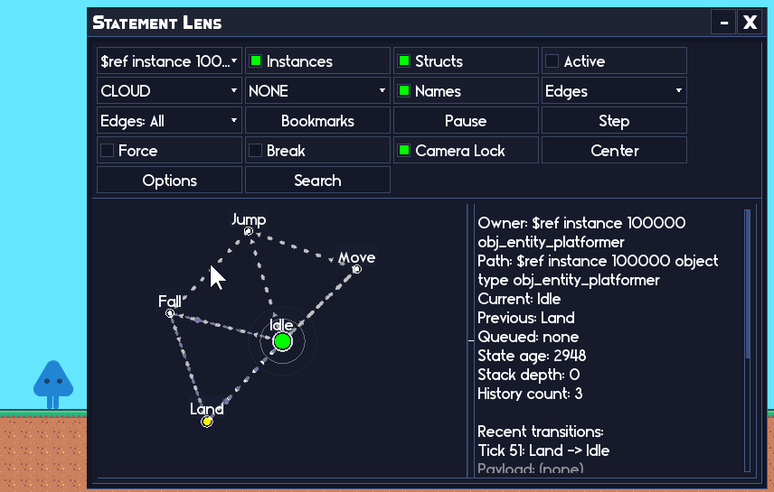

<div class="sticky-toc" markdown="block">
<details open markdown="block">
  <summary>On this page</summary>
  {: .text-delta }

1. TOC
{:toc}

</details>
</div>


{: .text-center}

*Hear what your game is telling you.*
{: .text-center}

You know the `show_debug_message` spiral:

You've been working on a feature for a week and you keep running into problems. You begin sprinkling debug messages throughout your code. More and more begin to pile up as you valiantly strive to find the problem. Then suddenly your output is a wall of text spam and the one line you actually need is lost amongst the noise...

Echo is my attempt to fix that problem without turning logging into a whole second job. It's a lightweight debug logger for GameMaker. It gives you:

- Urgency levels (INFO, WARNING, SEVERE)
- A debug level switch (log nothing, log only severe, log most things, or log everything)
- Optional tag filtering ("UI", "Combat", "Save", etc)
- A history buffer you can dump to a .txt file
- Structured history (for in-game UI, via Echo Chamber)

If you want the itch page: [Echo on itch.io](https://refreshertowel.itch.io/echo)

> Both of my other frameworks, [{: .framework-icon-small } **Statement**](https://refreshertowel.itch.io/statement) and [{: .framework-icon-small } **Pulse**](https://refreshertowel.itch.io/pulse) ship with **Echo** for free! So if either of them sounds interesting and you're thinking of buying Echo, grab them instead and get Echo bundled with them!
{: .important}

---

## What Echo is (in simple terms)

Echo is essentially just a smarter `show_debug_message`:

You log a message. Echo decides if it should be shown (based on your current settings). If it is shown, Echo also stores it in a history list for you.

So instead of "I hope I spot the right line in the output" you get "I can filter this and dump it to a file when things get busy".

> Echo comes packed with **Echo Chamber**, a UI framework specifically built to allow quick and easy development of complex UI's aimed at allowing you to create your own debug tools. Have a look at how quickly you can build a simple UI:
> [!Echo Chamber UI development](../assets/echo_chamber_promo.gif)
> And here is the implementation of [**Statements**](../statement/index.md) Lens visual debugger, written entirely with Echo Chamber:
> [!Statement Lens debugger](../assets/statement_lens_marketing.gif)
{: .bonus}
---

## The 30 second API

If you only learn three calls, learn these:

- EchoDebugInfo(message, [tag_or_tags])
- EchoDebugWarn(message, [tag_or_tags])
- EchoDebugSevere(message, [tag_or_tags])

SEVERE always includes a stack trace (and in COMPLETE mode, everything includes stack traces).

> `EchoDebug*()` functions return true if the message actually logged (passed your current filters), and false if it was ignored by your current settings.
{: .note}

---

## This is part of the RefresherTowel Games frameworks

Echo is part of the **RefresherTowel Games** suite of reusable frameworks for GameMaker. Every tool in the suite is designed to be:

* Easy to drop into a project
* Properly documented
* Feather-friendly (JSDoc annotations everywhere)
* And happy to work alongside the other tools, instead of fighting them

Check out the other frameworks currently available:

- [{: .framework-icon-small } **Statement**](https://refreshertowel.itch.io/statement) - An advanced state machine handler, easy to use for beginners, flexible enough for advanced users, with a fully interactive live visual debugger!
- [{: .framework-icon-small } **Pulse**](https://refreshertowel.itch.io/pulse) - A signals and events framework. Broadcast "what happened", let any number of listeners react. Includes queries (ask your game a question, anything that might want to answer responds!), tags, priorities, sender filters, queued dispatch, groups, and solid debug/introspection.

These frameworks are designed specifically to work together easily, to allow you to focus on actually making your games, rather than inventing tooling!

---

## Debug levels (what actually logs)

Echo has four debug levels:

- eEchoDebugLevel.NONE
  Logs nothing.
- eEchoDebugLevel.SEVERE_ONLY
  Logs only SEVERE.
- eEchoDebugLevel.COMPREHENSIVE (default)
  Logs WARNING + SEVERE (but not INFO).
- eEchoDebugLevel.COMPLETE
  Logs INFO + WARNING + SEVERE, and includes stack traces for everything.

You can switch it at runtime:

```js
EchoDebugSetLevel(eEchoDebugLevel.COMPLETE);
```

And you can read the current level (optionally stringified):

```js
var _lvl = EchoDebugGetLevel(false);
var _lvl_name = EchoDebugGetLevel(true);
```

---

## Tags (filter the noise)

You can tag individual logs by either passing a single tag as a string: `"UI"`, or pass multiple tags as an array: `["UI", "Input"]`.

Then you can tell Echo "only show logs that overlap these tags":

```js
EchoDebugSetTags(["UI", "Combat"]);
```

Important detail: if you set allowed tags and then log something with no tags, it will not pass the filter. This is intentional (filters that let untagged logs through are not filters :D ).
{: .important}

To clear the filter and allow everything again:

```js
EchoDebugClearTags();
```

---

## History and dumping (because scrolling through output is not a system)

Echo stores a history buffer while debugging is enabled:

- `EchoDebugGetHistory()`: Plain history lines.
- `EchoDebugGetStructuredHistory()`: Structured history entries (for UI).
- `EchoDebugGetRevision()`: A revision counter that increments when history changes.

You can cap history size (0 means unlimited):

```js
EchoDebugSetHistorySize(300);
```

And when you need to ship a bug report to your future self:

```js
EchoDebugDumpLog();
```

That writes a text file using `file_text_open_write` with a timestamped name.

---

## Echo Chamber (included)

Echo ships with Echo Chamber, which is a full in-game debug UI builder, learn more about it here: [Echo Chamber](/echo_chamber/echo_chamber.md).

If all you want is logging, you can ignore it. If you want to build real tooling (log consoles, inspectors, debug panels, whatever) Echo Chamber is where things get fun.

It also includes a built-in "Echo Console" window that can view your log history, search it, and tweak log level / tags / history size from inside the game.

I have used it to build debugging visualisers for all my frameworks, such as [Statement Lens, the real-time interactable visual debugger for Statement](https://refreshertowel.itch.io/statement) (an advanced yet easy to use state machine manager):


*A user is driving their state machine through Statement Lens, even setting an automated breakpoint which pauses the machine on the transition to the Fall state. Entirely driven by Echo Chamber.*

---

## Quick start (8 lines, no ceremony)

```js
// Somewhere shared:
#macro TAG_COMBAT "Combat"

// Example usage:
EchoDebugWarn("Player took damage", TAG_COMBAT);

if (hp <= 0) {
	EchoDebugInfo("Player died with hp <= 0", TAG_COMBAT);
}
```

---

## Where to go next

- [Usage & Examples (includes examples for how to build your own debug interface with Echo Chamber)](usage.md)
- [Full API Reference](scripting.md)

