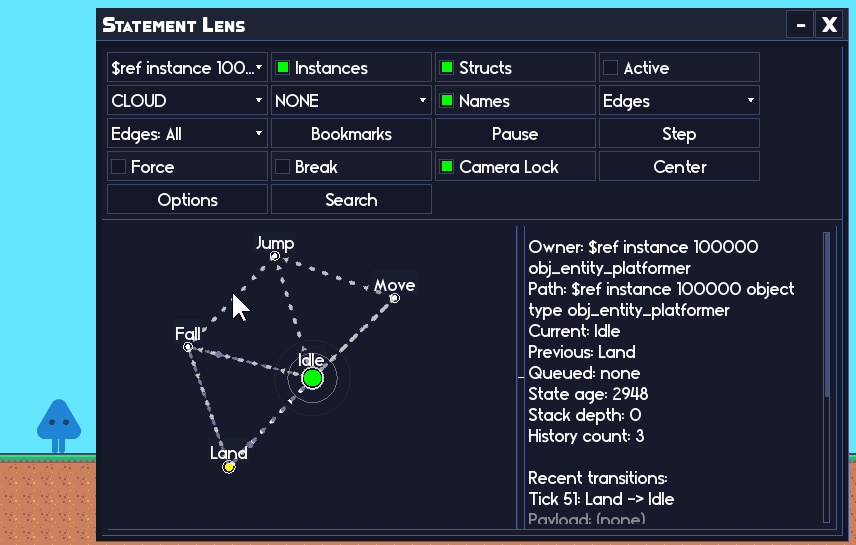

<div class="sticky-toc" markdown="block">
<details open markdown="block">
  <summary>On this page</summary>
  {: .text-delta }

1. TOC
{:toc}

</details>
</div>


{: .text-center}

*Hear what your game is telling you.*
{: .text-center}

Echo is a lightweight debug logger for GameMaker. It gives you a cleaner replacement for the usual pile of `show_debug_message()` calls, and allows you to add filtering and history when the output starts getting too busy.

If you want the itch page: [Echo on itch.io](https://refreshertowel.itch.io/echo)

> All of my other frameworks, [{: .framework-icon-small } **Statement**](https://refreshertowel.itch.io/statement), [{: .framework-icon-small } **Pulse**](https://refreshertowel.itch.io/pulse), [{: .framework-icon-small } **Catalyst**](https://refreshertowel.itch.io/catalyst) and [{: .framework-icon-small } **Whisper**](https://refreshertowel.itch.io/whisper) ship with **Echo** for free! So if either of them sounds interesting and you're thinking of buying Echo, grab them instead and get Echo bundled with them!
{: .important}

---

## Start by logging something

You don't need to configure Echo before you can use it. Put one of these wherever you would normally use `show_debug_message()`:

```js
EchoDebugInfo("Player entered the room");
EchoDebugWarn("Save file is missing");
EchoDebugSevere("Inventory failed to load");
```

The three functions describe how important the message is. `INFO` is ordinary diagnostic information, `WARNING` is something worth investigating, and `SEVERE` is for something seriously wrong. Severe messages include a stack trace automatically.

With Echo's default debug level, warnings and severe messages are shown while info messages stay quiet. If you're actively investigating something and want to see everything, switch to complete logging:

```js
EchoDebugSetLevel(eEchoDebugLevel.COMPLETE);
```

---

## When the output gets noisy

Once several systems are logging at once, give messages tags:

```js
EchoDebugInfo("Opened inventory", "UI");
EchoDebugWarn("Enemy path was blocked", "AI");
EchoDebugWarn("Save took longer than expected", "Save");
```

Then you can temporarily focus Echo on the systems you care about:

```js
EchoDebugSetTags(["UI", "Save"]);
```

When a tag filter is active, a message has to share at least one allowed tag to pass. Untagged messages don't pass an active tag filter. Clear the filter when you're done:

```js
EchoDebugClearTags();
```

The [Using Echo](usage) page builds on this with debug levels, history, raw capture, log dumping, and the difference between filtering what Echo captures and filtering what Echo Console displays.

---

## When you want in-game debug tools

Echo also comes with [Echo Chamber](../echo-chamber/), an in-game debug UI builder, and [Echo Console](../echo-chamber/console), a full in-game debugging suite. Echo Chamber is separate from the logger itself: you can use Echo without building any UI at all. Echo Console relies on Echo Chamber.

If you want to build your own in-game console, inspector, tuning panel, or any other debug style tool, Echo Chamber gives you windows, panels, controls, bindings, themes, and other stuff to accomplish that.


*Statement Lens, a visual state machine debugger, is built with Echo Chamber.*

---

## Where to go next

- [Using Echo](usage) teaches the logger from ordinary messages through filtering and history.
- [Echo API Reference](api-reference) is the exhaustive Echo logger reference.
- [Echo Chamber](../echo-chamber/) starts the in-game debug UI side of the package.

---


