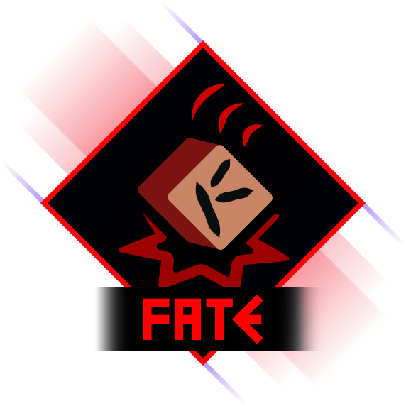

<div class="sticky-toc" markdown="block">
<details open markdown="block">
  <summary>On this page</summary>
  {: .text-delta }

1. TOC
{:toc}

</details>
</div>


{: .text-center}

*Decide your players' Fate.*
{: .text-center}

Fate is a weighted roll library for GameMaker. It supports simple value rolls, nested tables, policy-driven behavior (pity, duplicate protection, rate-up, guarantees), and state snapshots for save/load flows.

Fate is **not** just a loot drop system. It can easily be a backbone for your entire game. For instance, I use Fate as I build my map to determine what enemies should appear, with more difficult enemies being rarer drops. I also use it to determine what events the player will encounter. Nested tables allow me to easily build out drops from "global level", through to "this exact thing should happen", with each stage having a specific rarity and potential policies (essential Fate rules) influencing them. By tweaking drop rates and other things based on input from the game (such as difficulty level, region the player is in, etc) I can fairly easily build up an interesting ecosystem that drives the experience the player will have without a lot of fiddling on my end.

So don't *just* focus on Fate when thinking about what item a chest should give. Consider all the points in your game where you might want randomness to influence an outcome, and Fate will likely come in handy. It even allows you to directly instantiate instances and structs from constructors when they drop (using the `FateCreatorEntry()` drop), which can be useful in a variety of different situations.

If you're new to Fate, or maybe aren't super confident in your advanced GM skills, follow the beginner path first. It'll get you rolling quickly without making you juggle a bunch of advanced knobs, and you can easily switch over to the more advanced tooling later without interrupting your workflow.

Start here: [Getting Started](./getting-started.md) -> [Beginner Workflow](./beginner-workflow.md) -> [Policies Guide](./policies.md) -> [Advanced Workflow](./advanced-workflow.md) -> [Simulation Testing](./simulation-testing.md) -> [API Reference](./api-reference.md)

## Quickstart

Create a table, add entries, and roll values:

```js
// Create event
var _common = new FateValueEntry("COMMON").SetWeight(94);
var _rare = new FateValueEntry("RARE").SetWeight(6);

loot_table = new FateTable([_common, _rare])
	.EnablePity(_rare, 90, 75, 0.06);
```

```js
// Anywhere you roll
var _roll = FateRollValues(loot_table, 1);
if (_roll.ok) {
	var _value = _roll.GetFirstDrop();
	show_debug_message("Pulled: " + string(_value));
}
```

## Why Fate

Fate is built for two purposes: easy to use quick drop mechanics, and deep control when you're tuning or require very specific control over randomness. It includes beginner helper methods for common gacha behavior, an advanced policy API when you need full custom control, deterministic seeded RNG support, built-in state capture/restore for save systems, and validation helpers for configuration and state payloads.

In other words, it wraps up pretty much everything you need for a weighted drop system and gives you easy access to it, whether you're a beginner or a pro.

## Beginner and advanced surfaces

Fate is intentionally split into two layers. The beginner layer is `FateRollValues`, `FateTrackTable`, `FateSaveSnapshotFile`, and the table `Enable*` policy helpers. The advanced layer adds policy constructors, detailed roll traces, and manual state bundle helpers.

This lets you start simple, and gradually add complexity as you become more comfortable working with the library.

## Other Cool Stuff

If you like Quill, then be sure to check out my other libraries:

[{: style="max-width: 256px;"}](https://refreshertowel.itch.io/statement)
{: .text-center}

### [**Statement**](https://refreshertowel.itch.io/statement)
{: .text-center}

An easy to use state manager that comes packed with a lot of awesome features.
{: .text-center}

---

[{: style="max-width: 256px;"}](https://refreshertowel.itch.io/pulse)
{: .text-center}

### [**Pulse**](https://refreshertowel.itch.io/pulse)
{: .text-center}

A signals & queries manager that allows you to easily uncouple dependencies and simplify your code.
{: .text-center}

---

[{: style="max-width: 256px;"}](https://refreshertowel.itch.io/catalyst)
{: .text-center}

### [**Catalyst**](https://refreshertowel.itch.io/catalyst)
{: .text-center}

An extremely powerful stat manager, allowing you to quickly build stats for your games (such as attack power, or jump height) that can be easily modified and altered in a variety of ways. 
{: .text-center}

---

[{: style="max-width: 256px;"}](https://refreshertowel.itch.io/whisper)
{: .text-center}

### [**Whisper**](https://refreshertowel.itch.io/whisper)
{: .text-center}

A narrative manager that allows you to create complex, dynamic storytelling by providing simple rules that sit along your dialog/story. The roguelite "Hades" famous reactive storytelling is an example of what Whisper can help you do.
{: .text-center}

---

[{: style="max-width: 256px;"}](https://refreshertowel.itch.io/quill)
{: .text-center}

### [**Quill**](https://refreshertowel.itch.io/quill)
{: .text-center}

A free advanced text box creator for that automatically gives you text selection, right click context menus, cut/copy/paste, single-line or multi-line, tons of customisation options and a whole host of other features.
{: .text-center}

---

[{: style="max-width: 256px;"}](https://refreshertowel.itch.io/echo)
{: .text-center}

### [**Echo**](https://refreshertowel.itch.io/echo)
{: .text-center}

A debug manager that comes with a very fully featured Debug UI builder (in fact, Quill comes directly from the textboxes in Echo)
{: .text-center}