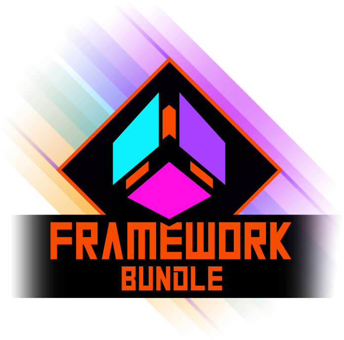
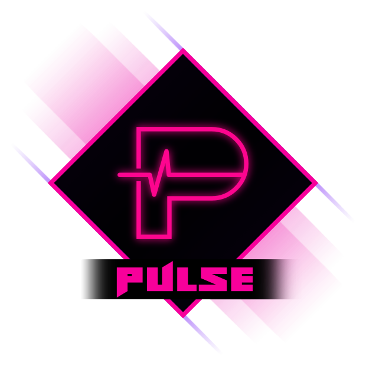
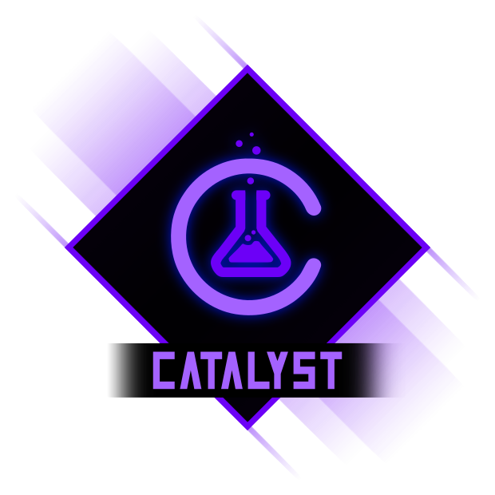
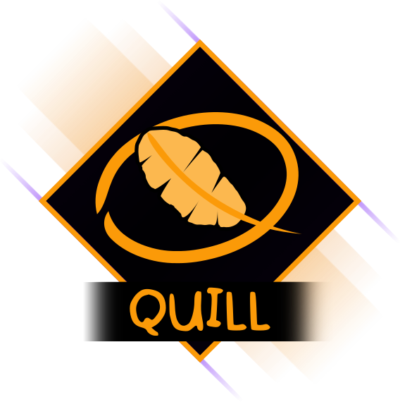
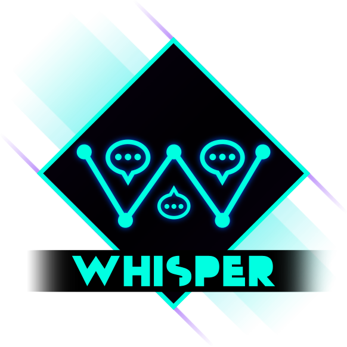
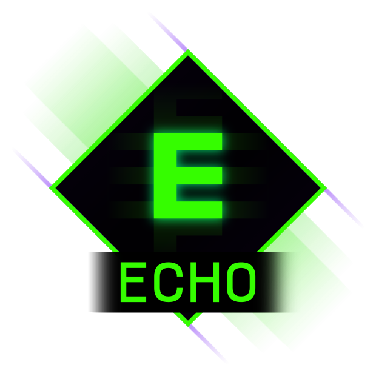

[{: style="width: 416px;" }]()
{: .text-center }
# Frameworks
{: .text-center}
*All you need in one bundle!*
{: .text-center}

Welcome to the hub for all documentation related to the GameMaker focused frameworks created by RefresherTowel Games.

Each framework is built to solve a specific pain point, with a clean API, full Feather support, and detailed docs.

---

- **Statement** decides what the game is doing.
- **Pulse** describes what just happened to anything listening.
- **Catalyst** deals with the numbers in your game, health, stats, buffs, etc.
- **Whisper** tells your game when it should show what dialogue, so it can feel reactive and alive.
- **Echo** tells you, in plain text, what all of the above actually did.

---

[{: style="max-width: 256px;"}](/docs/statement/)
{: .text-center }
## [**STATEMENT**](/docs/statement/)
{: .text-center }
> #### *Turn your states into a Statement!*

Sick of juggling `if` chains, tangled transitions, and forgetting where the specific `state ==` conditional you want is?

**Statement** is a clean, powerful state machine library for GameMaker that makes your game logic *not suck*. It gives each object (or struct!) its own brain, with clearly named states that handle `Enter`, `Update`, `Exit`, and optional `Draw` logic, all in one tidy place.

* **Built-in visual debugger:** Statement Lens lets you *see* your state machines live in-game...Inspect flow, watch transitions, set breakpoints, step frame by frame, even drive them manually. It’s wild.
* **Simple to start:** one machine, a few named states, one `Update()` call in Step. That's it.
* **Scales when you need it:** opt into advanced features like queued transitions, state stacks, history, transition payloads, per-state timers, and non-interruptible states.
* **Debug-friendly by design:** full API introspection, transition history, heatmaps, and logging (via the included Echo debug console).
* **Works with structs or instances**, so it plays nice with all your systems.

Use it for players, AI, UI, abilities, cutscenes. Anywhere things need to behave like... well, states.

Statement handles the boilerplate so you can focus on the behavior.
It’s the state machine library I wanted, so I built it for everyone.

<iframe frameborder="0" src="https://itch.io/embed/4088827?linkback=true&amp;border_width=2&amp;bg_color=132f4b&amp;fg_color=ffffff&amp;link_color=007992&amp;border_color=ffffff" width="554" height="169"><a href="https://refreshertowel.itch.io/statement">Statement by RefresherTowel</a></iframe>

##### [**EXPLORE THE STATEMENT DOCS**](/docs/statement/)
{: .text-center }

---

[{: style="max-width: 256px;"}](/docs/pulse/)
{: .text-center }
## [**PULSE**](/docs/pulse/)
{: .text-center }
> #### *The beating heart of your game*

Want your damage event to update the health bar, play a sound, spawn some particles, and poke the AI... without wiring a dozen scripts / instances together by hand?

**Pulse** is a signals / events layer for GameMaker that lets your game shout "something happened" and anything that cares to can listen in and react.

For small projects, it's dead simple:

* Subscribe once and stop passing instance ids all over your code.
* Fire a signal and let UI, audio, VFX, and gameplay all react in their own space.
* Keep things decoupled so you can swap or remove systems without a "squash all the bugs caused by coupling" session.

For bigger, messier projects, Pulse quietly scales up with you:

* Priorities and consumable signals so the right listener wins and can cancel the rest.
* Optional queued dispatch so you can post events now and flush them at a safe time later.
* A query API so you can ask the game a question ("who wants this target?") and collect structured answers.
* Subscription groups so entire states, rooms, or UI panels can clean up their listeners in one call.
* Multiple buses so gameplay, UI, and debug tools can each live on their own event channels.
* Safety features like weak refs, automatic pruning, and result enums so you can detect and debug weird cases instead of guessing.

If all you want is "emit event, something happens", Pulse does that in a couple of lines.
If you want your whole project to sit on a clean, debuggable event layer, Pulse is built for that too.

<iframe frameborder="0" src="https://itch.io/embed/4116520?linkback=true&amp;border_width=2&amp;bg_color=370028&amp;fg_color=ffffff&amp;border_color=ffffff" width="554" height="169"><a href="https://refreshertowel.itch.io/pulse">Pulse by RefresherTowel</a></iframe>

##### [**EXPLORE THE PULSE DOCS**](/docs/pulse/)
{: .text-center }

---

[{: style="max-width: 256px;"}](/docs/catalyst/)
{: .text-center }
## [**CATALYST**](/docs/catalyst/)
{: .text-center }
> #### *Turn raw numbers into reactions*

Struggling to keep your stats, buffs, and item effects under control as your game grows?

**Catalyst** is a feature rich yet easy to use stats and modifiers framework for GameMaker. It treats stats as living systems instead of isolated numbers.

- Handle health, damage, stats, resistances, buffs, debuffs, item bonuses, and more in one consistent way.
- Stack and combine effects without writing a new special case every time.
- Built for weird ideas: context aware modifiers, derived stats, and complex interactions without tearing up your code.

<iframe frameborder="0" src="https://itch.io/embed/4164612?linkback=true&amp;border_width=2&amp;bg_color=450074&amp;fg_color=ffffff&amp;link_color=9080ff&amp;border_color=ffffff" width="554" height="169"><a href="https://refreshertowel.itch.io/catalyst">Catalyst (GameMaker Moddable Stats) by RefresherTowel</a></iframe>

##### [**EXPLORE THE CATALYST DOCS**](/docs/catalyst/)
{: .text-center }

---

[{: style="max-width: 256px;"}](/docs/quill/)
{: .text-center }
## [**QUILL**](/docs/quill/)
{: .text-center }
> #### *Let your players write with ease*

Quill is an advanced text input library, designed to let you quickly and easily create interactable textboxes for your players. Quill automatically handles all the things that people expect when they encounter a textbox, such as caret movement, selection, clipboard, undo/redo, labels, right-click context menus, validation messaging, and proper theming including both basic primitives and sprites.

<iframe frameborder="0" src="https://itch.io/embed/4164612?linkback=true&amp;border_width=2&amp;bg_color=450074&amp;fg_color=ffffff&amp;link_color=9080ff&amp;border_color=ffffff" width="554" height="169"><a href="https://refreshertowel.itch.io/catalyst">Catalyst (GameMaker Moddable Stats) by RefresherTowel</a></iframe>

##### [**EXPLORE THE QUILL DOCS**](/docs/quill/)
{: .text-center }

---

[{: style="max-width: 256px;"}](/docs/whisper/)
{: .text-center }
## [**WHISPER**](/docs/whisper/)
{: .text-center }
> #### *Make your narrative scream with Whisper!*

Ever wanted to build a game that has a narrative that reacts to the players actions, like the narrative in Hades that "remembers what you did", or a storyteller-style stream of eligible events for a game like RimWorld? Or maybe trait-driven event chains and situational scenes that appear because of who your character is and what they've done like in Crusader Kings?

Then you want Whisper.

Whisper is a narrative manager built around the concept of "storylets". In essence, you add your story to Whisper, tell Whisper how you want that story managed, and then Whisper surfaces the right bit of story ("storylet") for the right moment in your game. 

<iframe frameborder="0" src="https://itch.io/embed/4234087?linkback=true&amp;border_width=2&amp;bg_color=004140&amp;fg_color=ffffff&amp;link_color=5bfae2&amp;border_color=ffffff" width="554" height="169"><a href="https://refreshertowel.itch.io/whisper">Whisper (GameMaker Narrative Director) by RefresherTowel</a></iframe>

##### [**EXPLORE THE WHISPER DOCS**](/docs/whisper/)
{: .text-center }

---

[{: style="max-width: 256px;"}](/docs/echo/)
{: .text-center }
## [**ECHO**](/docs/echo/)
{: .text-center }
> #### *Hear what your game is telling you*

Plain debug logs are fine at first, but quickly become noise once your project grows.

**Echo** is a lightweight **debugging** framework for GameMaker. Your game is always talking and Echo helps you hear what it's telling you. Instead of a wall of `show_debug_message()` calls, you get structured logs, levels, history, and other features that make problems stand out.

- Log at different levels and filter what hits the console.
- Keep a debug history for the current session and dump it to file when needed.
- Optional extras like stack traces and an easy way to mute all logging with a single setting.

Echo ships free with all available frameworks and integrates cleanly with their designs. Or you can purchase it for cheap on its own.

<iframe frameborder="0" src="https://itch.io/embed/4089088?border_width=2&amp;bg_color=1d471e&amp;fg_color=ffffff&amp;link_color=109200&amp;border_color=ffffff" width="554" height="169"><a href="https://refreshertowel.itch.io/echo">Echo by RefresherTowel</a></iframe>

##### [**EXPLORE THE ECHO DOCS**](/docs/echo/)
{: .text-center }