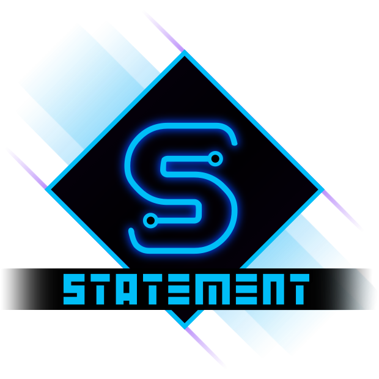

<div class="sticky-toc" markdown="block">
<details open markdown="block">
  <summary>On this page</summary>
  {: .text-delta }

1. TOC
{:toc}

</details>
</div>


{: .text-center}
# Statement
{: .text-center}
*Turn your states into a Statement!*
{: .text-center}

**Statement** is a lightweight but feature rich **state machine system** for GameMaker, designed to be your new go-to for state logic.

You can drop it into any project and get a full state machine running in just a few lines of code.

Most GameMaker projects start with a simple `state` variable and end with a mess of switches, flags, and special cases. Statement cuts through that. You give each object a state machine, define a few named states, and let Statement handle the rest. The result is code that is easier to read, easier to debug, and much easier to grow. And when you are ready to go beyond the basics, Statement has enough power under the hood to handle complex state machine behavior without changing that simple workflow.

<iframe frameborder="0" src="https://itch.io/embed/4088827?linkback=true&amp;border_width=2&amp;bg_color=132f4b&amp;fg_color=ffffff&amp;link_color=007992&amp;border_color=ffffff" width="554" height="169"><a href="https://refreshertowel.itch.io/statement">Statement by RefresherTowel</a></iframe>

---

> **Statement v1.1 has dropped!**
>
> Statement nows come with **Statement Lens**, an advanced visual debugger for your state machine!
>
> 
> - Interact with your state machine in real-time while you play!
> - Control your state machine directly through the visual debugger!
> - Examine how states transition between each other, what states are most active, the past history of the state machine, and more!
>
> *Statement Lens is free for all owners of Statement.*
{: .bonus}

Statement gives you:

- An easy to declare `Statement` state machine bound to an instance or struct.
- Named `StatementState` states with inbuilt **Enter / Update / Exit / Draw** handlers (plus easy extension of adding new handlers).
- **Chainable methods**: the fluid interface lets you chain your method calls one after the other. For example:
```js
idle_state = new StatementState(self, "Idle")
    .AddEnter(_enter_func)
    .AddUpdate(_update_func)
    .AddExit(_exit_func);
```
- Built-in **state machine** timing (i.e. how long a state has been active for).
- Optional advanced features like:
  - **Queued transitions**
  - **Declarative automated transitions** (simply set a condition for a state change and a target state and the state will automatically change when that condition is met)
  - **State stacks**
  - **State history**
  - **Transition payloads** (pass data easily between states as they change)
  - **Non interruptible states**
  - **Pause support** (halt updates for a state machine with one method call)
  - **Rich introspection and debug helpers**
  - *And more*

---

Statement is part of the **RefresherTowel Games** suite of reusable frameworks for GameMaker. It is the first release in the line, with more frameworks to follow as their documentation is finalized. Every framework in the suite will ship with extensive docs and full Feather integration to keep them easy to drop into your projects.

Check out the other frameworks currently available:

- [{: .framework-icon-small } **Pulse**](https://refreshertowel.itch.io/pulse) - An advanced state machine handler, easy to use for beginners, flexible enough for advanced users, with a fully interactive live visual debugger!
- [{: .framework-icon-small } **Echo**](https://refreshertowel.itch.io/echo) - A lightweight debug logging tool, allowing you to prioritise and filter debug messages, alongside dumping them to file easily.

These frameworks are designed specifically to work together easily, to allow you to focus on actually making your games, rather than inventing tooling! [See how you might use them with Statement here!]()

> Statement ships with [**Echo**](../echo/) (a minimalist, yet powerful, debug logging framework) for free!
{: .important}

---

## Introduction

Statement replaces scattered `if (state == ...)` checks or giant switch statements with a clear structure:

- Each object (or struct) owns a `Statement` state machine.
- Each state machine manages one active `StatementState` at a time.
- States can define:
  - `Enter` (runs once when entered)
  - `Update` (runs each when called, usually each Step)
  - `Exit` (runs once when leaving)
  - `Draw` (optional, simply run it in a Draw Event to add an easy to manage drawing handler for a state)

You can keep things **very simple** (just one state and `Update`) or layer on more advanced features as your project grows.

---

## Basic Features (Core)

These are the features most users will use day-to-day:

- **Owner-bound states**  
  State code is automatically scoped to the owner instance or struct. No need to worry about figuring out how to access your instance from within the state.

- **Clear lifecycle**  
  Per-state handlers:
  - `Enter` - one-time setup when the state becomes active.
  - `Update` - per-step logic while active.
  - `Exit` - one-time cleanup when the state stops being active.
  - `Draw` - optional per-state drawing.

- **Simple state timing**  
  Each state machine tracks **how long the current state has been active** (in frames):
  - `GetStateTime()` / `SetStateTime()` on the `Statement` state machine.

- **Named states & transitions**  
  - `Statement.AddState(state)`
  - `Statement.ChangeState("Name")`
  - `Statement.GetStateName()`
  - `Statement.GetLastTransitionData()` for payloads attached to the most recent transition.

- **Feather-friendly**  
  Functions are fully annotated with JSDoc-style comments for better autocompletion and linting in GameMaker's code editor.

If you're a beginner or just need something straightforward, you can safely stop at these features.

---

## Advanced Features

These features are entirely optional. You only need them if your project calls for more control or introspection.

- **Queued transitions**
  - `QueueState()` to request a state change.
  - `ProcessQueuedState()` to apply it later.
  - `SetQueueAutoProcessing()` to have `Update()` handle it automatically.
  - Queued transitions respect a state's `can_exit` setting and will wait until the state allows exiting, unless the transition is forced.

- **Declarative transitions**
  - Define transitions directly on a `StatementState` with `AddTransition(target_name, condition, [force])`.
  - Each `Update()`, after running the state's Update handler, Statement evaluates these transitions in the order they were added.
  - As soon as a condition returns true, the machine will change to the target state (again respecting `can_exit` unless forced).
  - This is ideal for AI style behaviour such as "Idle until the player is close, then Chase" without having to call `ChangeState` manually.

- **Transition payloads**
  - All state changes can carry an optional payload object:
    - `ChangeState("Hurt", { damage: _damage, source: _source });`
    - `QueueState("Attack", { target: oPlayer });`
    - `PushState("Menu", { from: "Game" });`
  - The state machine remembers the payload for the last successful transition:
    - `Statement.GetLastTransitionData()`.
  - The state change hook receives it as the second argument so you can record or react to extra context.

- **State stack (Push / Pop)**
  - `PushState("Menu")` and `PopState()` for temporary overlays like pause menus, cutscenes, or modals.
  - Preserves clean Enter and Exit lifecycles.
  - Helpers such as `GetStateStackDepth()`, `PeekStateStack()`, and `ClearStateStack()` for inspection and maintenance.

- **History and introspection**
  - `previous_state` and `previous_states[]` history.
  - `SetHistoryLimit(limit)` to cap memory usage.
  - Helpers like:
    - `GetHistoryCount()` and `GetHistoryAt(index)`.
    - `GetPreviousStateName()`.
    - `ClearHistory()` and `WasPreviouslyInState("Name", [depth])`.

- **Non interruptible states**
  - Each `StatementState` has a flag that controls whether the machine is allowed to leave that state.
  - When the flag is false, all normal transitions into other states are blocked until you turn it back on.
  - This is ideal for stagger states, unskippable attack windows, or short cinematics that must not be interrupted by other systems.
  - A separate `force` flag on transitions lets you override this when you need emergency changes such as a "Dead" state.

- **Pause support**
  - `Statement.SetPaused(true)` stops the machine from processing in `Update()`:
    - No Update handlers are run.
    - No queued transitions are processed.
    - No declarative transitions are evaluated.
    - The state age does not advance.
  - Draw and manual calls such as `ChangeState()` still work while paused so you can safely apply forced transitions or visual changes.

- **Per state timers**
  - Optional advanced timers on each `StatementState` handled via time sources.
  - Helpers like `TimerStart()`, `TimerGet()`, `TimerPause()`, `TimerRestart()`, and `TimerKill()`.
  - Global `StatementStateKillTimers()` to clean up all state timers at once for example on a change of room.

- **State change hook**
  - `SetStateChangeBehaviour(fn)` to run custom logic whenever the state changes (for logging, analytics, signals, and more).
  - Your hook is called as `fn(previous_state, data)` where `data` is the payload passed into the transition if one was supplied.

- **Custom state handlers**
  - Add extra handlers beyond the built in Enter, Update, Exit, and Draw easily (for example an Animation End handler
    that runs in the Animation End Event).

- **Debug and inspection**
  - `PrintStateNames()` dumps all registered states on the machine.
  - `DebugDescribe()` returns a one line summary of the machine including owner, current state, previous state, state age, queued state name, stack depth, and history count.
  - `PrintStateHistory([limit])` logs the previous state history for this machine from most recent backwards.

You can safely ignore all of these if you so wish. Statement is designed to "just work" with only the core features, but provide a large amount of hidden depth with these more advanced options.

---

## Requirements

- **GameMaker version:**  
  Any version that supports:
  - Struct constructors: `function Name(args) constructor { ... }`
  - `method(owner, fn)`
  - `time_source` APIs

- **Scripts you need:**
  - The Statement script library.
  - The **Echo** debug helper library (shipped free with Statement). It provides the debug functions used throughout Statement: `EchoDebugInfo`, `EchoDebugWarn`, and `EchoDebugSevere`.

> Statement's examples and internal debug calls use these Echo helpers. If you remove Echo from your project or choose not to import it, you can either write some simple `show_debug_message()`
> wrapper functions with the same names, such as:
```js
function EchoDebugInfo(_string) {
  show_debug_message(_string);
}
function EchoDebugWarn(_string) {
  show_debug_message(_string);
}
function EchoDebugSevere(_string) {
  show_debug_message(_string);
}
```
> Or update the debug calls in Statement to use your own debug system instead.
{: .note}

No additional extensions or assets are required.

---

## Quick Start (Core)

A minimal example: single machine, single state.

**Create Event**
```js
state_machine = new Statement(self);

var _idle = new StatementState(self, "Idle")
    .AddEnter(function() {
        EchoDebugInfo("Entered Idle");
    })
    .AddUpdate(function() {
        // Simple idle behaviour
        image_angle += 1;
    });

state_machine.AddState(_idle);
```

**Step Event**
```js
state_machine.Update();
```

**Draw Event (optional)**
```js
state_machine.Draw();
```

That's all you need to get a basic state machine up and running.

> If you find `new Statement(self)` and `new StatementState(self, "Idle")` a bit verbose, it's perfectly fine to define your own project-specific helper function that wraps the constructor call, for example:
> ```js
> function SM() {
>   return new Statement(self);
> }
> function State(_state_name) {
>   return new StatementState(self, _state_name)
> }
> ```
> Statement itself does **not** ship any  helpers like this to avoid name clashes with other libraries.
{: .note}

Always construct `Statement` and `StatementState` using the `new` keyword (for example `state_machine = new Statement(self);`). Calling these constructors without `new` will silently fail and your state machine will not work.
{: .warning}

---

## Quick Start (with transitions and payloads)

Here is a slightly more advanced example that:

- Uses two states (`Idle` and `Hurt`).
- Changes into `Hurt` with a payload.
- Reads that payload in the `Hurt` state's Enter handler.

**Create Event**
```js
state_machine = new Statement(self);

var _idle = new StatementState(self, "Idle")
    .AddUpdate(function() {
        // Idle code
    });

var _hurt = new StatementState(self, "Hurt")
    .AddEnter(function() {
        // First we grab the payload that was given during the transition to this state (the transition occurs in
        // the codeblock below this one, in the collision event with the enemy bullet)
        var _data = state_machine.GetLastTransitionData();
        if (is_struct(_data)) {
            // And now we can use the data, in this case printing the damage we took to console
            EchoDebugInfo("Entered Hurt with damage: " + string(_data.damage_taken));
        }
    })
    .AddUpdate(function() {
        // Recovery logic here.
        // When done, return to Idle.
        if (hurt_anim_finished) {
            state_machine.ChangeState("Idle");
        }
    });

state_machine
    .AddState(_idle)
    .AddState(_hurt);
```

**On collision with enemy bullet**
```js
var _current_hp = hp;
hp -= other.damage;
var _hp_change = _current_hp - hp;
// Now we switch to the hurt state, providing the amount of damage taken as the optional payload for us to read in the hurt state
state_machine.ChangeState("Hurt", { damage_taken: _hp_change });
```

---

## FAQ (Core)

### Do I need one `Statement` per object?

While this the generally intended pattern:

- In an object's Create event: `state_machine = new Statement(self);`
- Then add states to that machine for that object.

You can have as many state machines per object as you want without any problems. You can *also* bind a machine to a pure struct if you're doing headless logic, but "one object, one machine" is the most common usage.

---

### Do I have to use the Draw support?

No. Draw is completely optional.

Common patterns:

- **Logic only**: call `Update()` in Step and ignore Draw.
- **Logic + visuals**: call `Update()` in Step and `Draw()` in Draw, with per-state `AddDraw()` handlers.

---

### What's the difference between `GetStateTime()` and per-state timers?

- `GetStateTime()` / `SetStateTime()` live on the **Statement** state machine itself:
  - Represent "how long the current state has been active (in frames)".
  - Automatically reset on state change.
  - Incremented in `Update()` while a state is active.

- Per-state timers (`TimerStart()`, `TimerGet()`, etc.) live on each individual **State** struct:
  - Optional, more flexible timers backed by `time_source`.
  - Once started, a state's timer advances every frame via a time source until you change out of that state or explicitly stop/pause/reset the timer, even if `Update()` is not being called for a while.
  - Good for specialised behaviour that needs pausing, restarting, or independent ticking across different update rates (for example, these timers continue ticking even if the instance is disabled).

In 99% of cases you'll just use `GetStateTime()` on the machine and ignore per-state timers entirely.

---

## FAQ (Advanced)

### When should I use queued state changes?

Use **queued changes** when:

- You're inside a state's `Update` and want to change state *next* frame.
- You want to avoid "mid-update" re-entrancy issues where code before and after `ChangeState()` runs in different states.

Use **immediate `ChangeState()`** when:

- You're doing a hard switch (spawning, respawning, teleporting).
- You know you're at a safe point in your logic.
- In general, it's safe to simply use `ChangeState()`, but queueing will occasionally be necessary in some circumstances.

---

### When do I need Push/Pop instead of `ChangeState`?

Use `PushState` / `PopState` for:

- Temporary overlays (pause, menu, inventory, cutscenes).
- Situations where you want to "change to a new state and then return to whatever state we were in before".

Use `ChangeState` when:

- You're switching between normal, "flat" states (Idle -> Move -> Attack).

---

### How do I make a state non interruptible?

Each `StatementState` has a `can_exit` flag. When it is false, the state machine will refuse to leave that state unless a transition is explicitly forced.

A common pattern is a stagger state:

```js
var _stagger = new StatementState(self, "Stagger")
    .AddEnter(function() {
        state_machine.GetState().LockExit();
    })
    .AddUpdate(function() {
        if (state_machine.GetStateTime() >= game_get_speed(gamespeed_fps) * 0.5) {
            // We've been staggered for half a second, so unlock the exit blocker and change state
            state_machine.GetState().UnlockExit();
            state_machine.QueueState("Idle");
        }
    });
```

If you need an emergency override, you can use the force flag while changing the state
```js
state_machine.ChangeState("Dead", undefined,true);
```
This forces the state change to ignore the can exit flag on the state.

---

### How do I pause a state machine?

Call `SetPaused(true)` on the machine:

```js
state_machine.SetPaused(true);  // freeze automatic processing
```

While paused:

- `Update()` does nothing.
- Queued transitions are not processed.
- Declarative transitions are not evaluated.
- The state age does not advance.

Draw and manual transitions still work:
```js
if (state_machine.IsPaused()) {
    // Still allowed:
    state_machine.ChangeState("Dead", undefined, true);
}
```

To resume, call:
```js
state_machine.SetPaused(false);
```

---

## Help & Support

#### **Bug reports / feature requests:**  
  The best place to report bugs and request features is the GitHub Issues page:

  [**Statement issues**](https://github.com/RefresherTowel/Statement/issues)

  Please include:

  - A short code snippet.
  - Which functions you called (`ChangeState`, `QueueState`, etc).
  - Any relevant debug output from `EchoDebugInfo/EchoDebugWarn/EchoDebugSevere`.

  If you are not comfortable using GitHub, you can also post in [**the Statement discord channel**](https://discord.gg/8spFZdyvkb) and I can file an issue for you.

#### **Questions / discussion / examples:**  
  Join [**the Statement discord channel**](https://discord.gg/8spFZdyvkb) to:
  - Ask implementation questions.
  - Share snippets and patterns.
  - See example integrations from other users.
