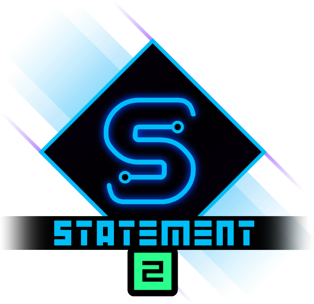

<div class="sticky-toc" markdown="block">
<details open markdown="block">
  <summary>On this page</summary>
  {: .text-delta }

1. TOC
{:toc}

</details>
</div>


{: .text-center}

*Turn your states into a Statement!*
{: .text-center}

Most GameMaker projects start with a humble little `state` variable.

And then, slowly, you add a few flags. Then a switch. Then a second switch "just for the special case". And by the end you have a two-storey high switch block full of special edge cases and workarounds, and now you've got a bug that only appears when you roll into a ladder on Tuesday with 22.5% health exactly and you have to try to disentangle the frankenstein'd code...

Yeah, that's what Statement is here to help with.

**Statement 2** is a feature rich **state machine framework** for GameMaker that replaces that mess with something simpler while also being far more powerful.

You can start extremely simply, then add the more powerful parts only when your game actually needs them.

<iframe frameborder="0" src="https://itch.io/embed/4088827?linkback=true&amp;border_width=2&amp;bg_color=132f4b&amp;fg_color=ffffff&amp;link_color=007992&amp;border_color=ffffff" width="554" height="169"><a href="https://refreshertowel.itch.io/statement">Statement 2 by RefresherTowel</a></iframe>

---

## What does a Statement state machine look like?

In the object's **Create Event**, make the machine:

```js
state_machine = new Statement(self);
```

Make a state:

```js
var _idle = new StatementState(self, "Idle")
	.AddUpdate(function() {
		// State code goes here
	});
```

Then add it to the machine:

```js
state_machine.AddState(_idle);
```

In the object's **Step Event**:

```js
state_machine.Update();
```

That's all you need to have a working state machine.

The first state you add is the one Statement begins with, so the example above starts in the `Idle` state. When you add more states later, you can easily call `ChangeState("state name")` to switch between them.

From that simple beginning you can add as much complexity as you like. Need a simple way to handle player movement? The above code gets you there quickly and easily. Have a very complicated system of attacks and phases for a boss? Then dive deep into the rich tooling that Statement offers like nested state machines, exit guards, transition rules, and more. Statement is as easy, or complex, to use as you desire.

---

## Why use Statement?

Statement keeps the code that belongs in states in one simple place with extremely easy ways to extend and modify it to behave exactly as you want.

As the requirements of your machine grows, Statement can grow alongside it, being able to handle things such as:

- automatic state changes when a condition becomes true
- exit locks and guards for states that cannot always be interrupted
- queued transitions for buffered input
- temporary states that return to where they came from
- pause, time scaling, and state timers
- nested state machines
- reusable state templates
- custom state events and machine-wide hooks

You don't need to learn how to use all those features before using the library. A machine can remain as small as the initial example for as long as you want, but when the time inevitably comes when you decide "Hmmm, I really need an exit lock" or something like that, you don't have to replace your existing code.

---

## Statement Lens

Statement also includes **Statement Lens**, a visual debugger for inspecting your machines while the game is running.

Once a machine becomes large enough that looking at the code no longer immediately tells you what happened, Lens can show the active state, child machines, blocked transitions, queued requests, transition rules, history, pause reasons, and the routes the machine has actually taken. You can also actively drive your state machine via Statement Lens (for instance, force a character to transition to their jumping state), which can be extremely helpful when dealing with complicated state machines like a bosses fight phases, allowing you to swap between states at will.


> *Statement Lens is free for all owners of Statement and is included with the library.*
{: .note}

---

## Where to go next

Start with [**States & Lifecycle**](states_and_lifecycle). It builds out a real player machine and introduces the proper state life cycle.

From there, the docs add one problem at a time: passing data between states, automatic transitions, locks and queues, temporary states and history, timing, nested machines, templates, hooks, custom events, and finally the full Lens guide, so you can work your way up from knowing nothing about Statement to being a Statement expert in a simple stepped progression.


