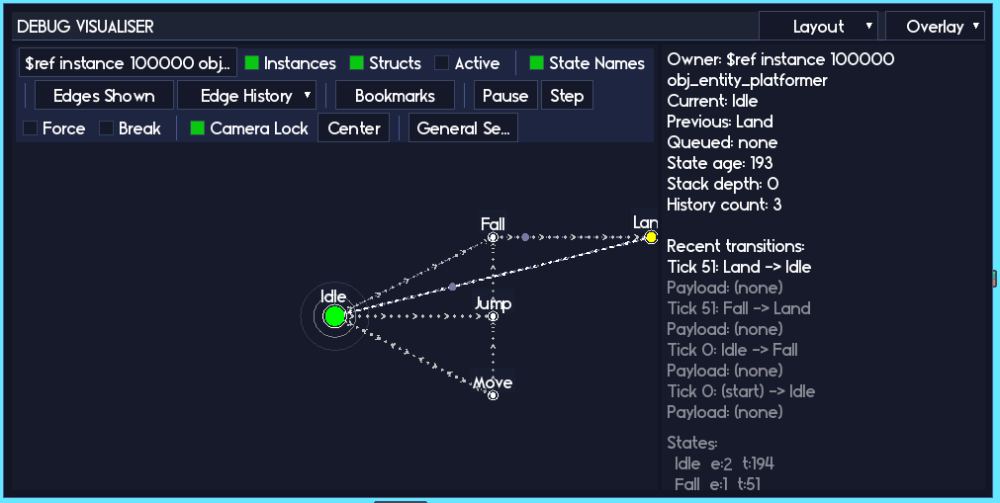
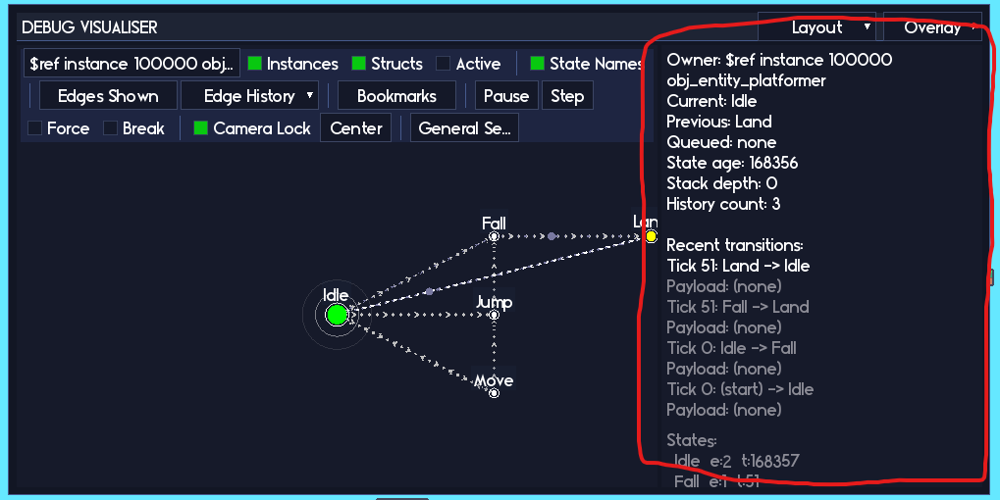
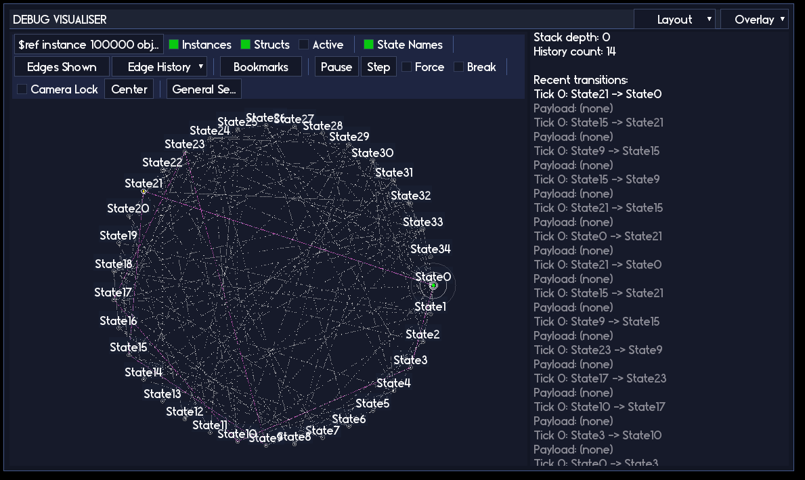
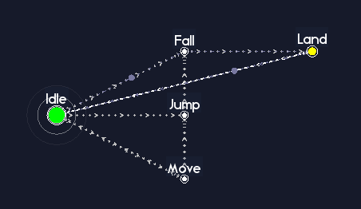
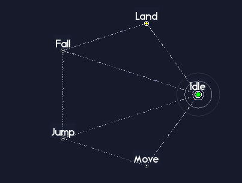
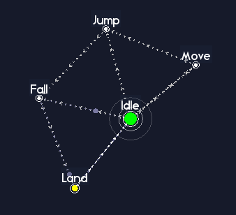
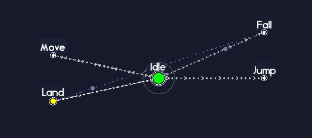

<div class="sticky-toc" markdown="block">
<details open markdown="block">
  <summary>On this page</summary>
  {: .text-delta }

1. TOC
{:toc}

</details>
</div>

# Statement Lens


So, you have a bunch of state machines running around your project causing trouble, and you would like to actually see what those little gremlins are doing rather than guess from a wall of `show_debug_message` calls. That is what Statement Lens is for.

**Statement Lens** is the centre-piece of the **Statement v1.1** update. It is a **fully visual debugger**(!) that draws your machines as clickable graphs, shows you where they are right now, where they have been, and what they are trying to do next. Think of it as a live map of your game logic.

You do not need Lens to use Statement. You can happily ship a game without ever opening it. But once your project grows past "one or two tiny machines in a jam game", Lens becomes a big quality of life upgrade. It turns a lot of painful "why is this not doing what I think it is doing" moments into "oh, it is stuck in this state because of that edge right there".

On this page we will walk through the visualiser in three passes:

- Beginner: get the visualiser on screen, point it at a machine, and learn how to read the basics.
- Intermediate users: filters, history, overlays, and bookmarks so bigger graphs stop feeling like spaghetti.
- Power users: breakpoints, debug jumps, EGO mode, and some extra tricks for when your machines get spicy.

You do not have to memorize everything at once. Treat it like a skill tree. Grab the beginner stuff first, then come back and unlock the intermediate and power toys when your machines level up enough to need them.

> Statement Lens is currently in a BETA state. It should absolutely be functional enough to use and it can't harm anything about your game, so don't be hesitant to try it out. However, some parts of it may be a little janky and I'm still working on what's important to show vs what I should be gating behind drop down menus (plus any other ways to reduce visual noise while maintaining good information density).
>
> Please [**join the discord**](https://discord.gg/8spFZdyvkb) and offer suggestions or features, and detail any bugs you encounter!
{: .warning}

> Statement Lens is using a very early version of the **Echo Display UI**. This is a framework for easily building out interactable debugger tools, like Lens, and will be included as a part of the Echo framework when it is finished. All RefresherTowel Games frameworks will utilise this UI to build interesting, informative live debugging tools to help you move fast and fix things as easily as possible! Plus, you'll be able to get your own debugging windows set up quickly and easily, giving you maximum power to make your games!
{: .bonus}

---

## 1. Getting set up

Before we can stare at pretty graphs, we need to do two things:

1. Tell Statement it is allowed to gather debug info.
2. Give the visualiser a place to update and draw.

Once this is wired in, the rest of the page is just learning how to poke the UI.

### 1.1 Enabling the debug build

All of the visual debugger code is wrapped behind the `STATEMENT_DEBUG` macro in `scr_statement_macro`:

```js
#macro STATEMENT_DEBUG 1
```

While you are in development, leave this as `1`. That switches on:

- Extra debug info on machines and states (graph edges, history, timers, etc).
- A global list of machines that the visualiser can see.
- A single global visualiser struct sitting in `global.__statement_visualiser`.

For your final release builds, you can (and usually should) set `STATEMENT_DEBUG` to `0`. That strips out:

- The visual debugger UI.
- The extra bookkeeping.
- The global machine registry.

Nothing in your game code needs to change. When `STATEMENT_DEBUG` is `0`, the debug helpers just turn into no-op functions that do nothing.

> If the visualiser is not showing up at all, the very first thing to check is that `STATEMENT_DEBUG` is set to `1` in the build you are actually running.
{: .note}

You do not need to manually register machines. If you are constructing your machines through the usual `new Statement()` constructor calls, they will quietly register themselves while debug is on.

### 1.2 Hooking the visualiser into your game

Next, we need to give the visualiser a chance to run every frame. There are two global helper functions that you drop into your game loop:

```js
/// Step event of some always-present controller object
StatementLensUpdate();

/// Draw GUI event of the same object
StatementLensDraw();
```

Both functions are safe to leave in permanently:

- When `STATEMENT_DEBUG` is `1`, they update and draw the visual debugger.
- When `STATEMENT_DEBUG` is `0`, they do nothing and return immediately.

A common pattern is:

1. Create a little controller object, for example `obj_debug_statement`.
2. Put `StatementLensUpdate()` in its Step event.
3. Put `StatementLensDraw()` in its Draw GUI event.
4. Only place that object in rooms you care about, or only in your "debug" config.

That is it. Run the game, and you should see the visual debugger appear over the top of your game window, usually tucked into the corner by default.



If you do not see anything:

- Check `STATEMENT_DEBUG`.
- Make sure your controller object is actually in the room.
- Make sure you are using the Draw GUI event, not the regular Draw.

### 1.3 Optional: giving machines nice names

By default, machines are displayed using a description of their owner, for example:

- `$ref instance 100001 obj_player`
- `struct` for struct-based machines.

This is technically correct, but it gets old quickly when you have a lot of machines. You can give each machine a friendlier label using `SetDebugName` and `DebugTag`:

```js
player_sm
    .SetDebugName("Player movement")
    .DebugTag("player, movement, core");
```

- `SetDebugName(name)` sets the big label used in the machine picker.
- `DebugTag("comma, separated, tags")` lets you group and filter machines in the UI.

A few tips:

- Use `SetDebugName` for "what is this machine for".
- Use `DebugTag` for "what family does this belong to", for example `ui`, `combat`, `boss`, `dialogue`, etc.
- You can add or change these at any time; the next frame the visualiser will pick them up automatically.

You do not have to do this up front, but you will thank yourself later when you are trying to find "that one combat machine" in a long list.

---

## 2. Beginner: seeing your first machine

With the setup done, let us take a gentle first pass through the visualiser. The beginner goal is simple:

- Pick a machine.
- See it drawn on screen.
- Understand the basic panels well enough to answer "what state are we in" and "what did we just do".

Once that feels normal, we can start layering on the fancy bits.

### 2.1 The Visual Debugger window

Just a few tips about the debugger window:

- You can drag it by clicking and dragging the "DEBUG VISUALISER" header area.
- You can resize the window by clicking and dragging the bottom right corner of the window.

### 2.2 Picking a machine

At the top left of the visualiser you will see a machine picker bar. It will show something like:

> `$ref instance 100001 obj_player ...`

or, if you used `SetDebugName`, something like:

> `Player movement`

Click this bar and you will get a searchable dropdown of all known machines.


Things you can do here:

- Scroll the list with the mouse wheel.
- Type to filter by debug name, tag, or owner text.
- Use the `Instances` and `Structs` toggles to include or exclude those machine types.
- Use the `Active` toggle to show only machines that currently have a state selected.

Pick a machine from the list and you should see its state graph appear in the main panel.

If you do not see a machine that you definitely know should exist:

- Check that `STATEMENT_DEBUG` is on.
- Make sure you actually created the machine before the visualiser update runs.
- Double check that you are not filtering it out with the toggles.

### 2.3 Panning and zooming

The main graph view is fully interactive. You are not stuck with whatever layout it gives you the first time.

Basic camera controls:

- Scroll wheel: zoom in and out.
- Middle mouse drag (or right mouse drag, depending on your settings): pan the camera.
- `Center` button in the toolbar: snap the camera to the currently selected state.
- `Camera Lock` toggle: in some modes this will keep the camera roughly centered on the active state.

Typical pattern:

1. Pick a machine.
2. Hit `Center` to find it.
3. Scroll out to see the big picture.
4. Scroll in to investigate the part you care about.

If you lose the machine off screen (it happens), hit `Center` again. That button is your "stop being lost" teleporter.

### 2.4 Reading the right-hand panel



The panel on the right is your "at a glance" summary for the selected machine. It will show things like:

- Owner (`obj_player`, some enemy, a struct, etc).
- Current state, previous state, and queued state (if any).
- How many frames have been spent in the current state.
- Stack depth and history counts (if you are using stacks or history).
- A short list of recent transitions.
- A little table of per-state stats (entries and total frames per state).

As a beginner, you can get a surprising amount of value just from this panel alone. A few example questions it answers very quickly:

- "Are we stuck in this state?"  
  Look at the state age and entry count. If the age is huge and the machine never leaves, you have a problem.
- "Why does it keep bouncing between these two states?"  
  Watch the recent transitions. You will see a repeating pattern if it is flip flopping.
- "Does this state ever run at all?"  
  Check the entries column. If it is zero, the machine has never managed to get there.

Instead of guessing from code or adding more logs, you can look at what the machine thinks is happening right now.

### 2.5 Hovering and clicking nodes

States are drawn as circular nodes on the graph. Edges between them represent transitions or debug links.


Rough idea:

- Solid edges are structural edges that come from real transitions in the machine.
- Dotted or differently styled edges can be debug-only links or history trails, depending on what you have turned on.

Basic interactions:

- Hover a node to highlight its edges and deaccentuate other nodes.
- Left click a node to select it (so the state info shows up in the panels).
- Right click a node to bring up a context panel with more detailed info about that state.
- Right click an edge to bring up a context panel with more detailed infor about that transition.

One of the coolest elements of Statement Lens is the ability to control the state machine directly by the debugger. If you have the `Click to jump` toggle (under `General Settings`) enabled (it is enabled by default), then left clicking a node does a special thing: it asks the machine to jump straight to that state for you! This "put me into this state right now so I can test it" workflow is extremely handy for all sorts of situations. Explore and test your whole state machine just by clicking through the nodes on the screen.


The state context panel can show, among other things:

- Whether the state is currently active or has been active in the past.
- How many times it has been entered.
- How many frames total it has been active.
- Any debug tag or default payload set on that state.
- Per-state options like `Break on enter` and `Can exit` that you can toggle live.

You are allowed to poke these. They are debug-only flags, they do not change your saved game state or your shipped code. Use them as temporary switches while you investigate.

### 2.6 Toggling labels and edges

Along the top toolbar there are some simple, but very helpful, visibility toggles:

- `State Names`: show or hide the text labels next to each node.
- `Edges Shown`: choose which types of edges are drawn (structural, debug-only, history, etc).
- `Edge History`: limit edges to "all time" or "only edges that were active in the last N ticks".

When your graph starts to look like a bowl of noodles, do not suffer through it. Master the pasta by hiding labels or restrict to "Last 50" edges and you will usually get a much clearer picture of the recent behavior.



For a very quick sanity check:

1. Turn on an overlay (for example heat by time, see later).
2. Set `Edge History` to "Last 500".
3. Run around in game for a bit.
4. Pause and look. The hot nodes and edges will show you exactly where the action has been.

At this point, if you can:

- Pick your player or enemy machine in the list.
- Watch the active state light up as you move, jump, attack, etc.
- See state names and transitions update on the right.

then you have already unlocked most of the day to day value of the debugger. The rest of this page is about turning it into a more advanced tool when your machines grow up.

---

## 3. Intermediate users: filters, overlays, history, bookmarks

Once you have more than a couple of machines, the visual debugger turns into a little dashboard for your project. This section is about keeping that dashboard under control so it helps rather than overwhelms.

### 3.1 Machine filters and search

The machine picker bar has a few quality of life options built in.

Toggles:

- `Instances`: show or hide machines whose owners are GameMaker instances.
- `Structs`: show or hide machines owned by plain structs.
- `Active`: show only machines that currently have a state (hides machines that have not started yet, or have been torn down).

When you click the machine picker, the first entry in the dropdown is a text box. Click that and start typing:

- Part of the `SetDebugName` string.
- Part of the object name (for instance `obj_enemy`).
- A tag you assigned with `DebugTag`.

The list below will filter as you type.

> There is also a state search palette that you can open with the keyboard shortcut defined in `scr_statement_macro` (by default `Ctrl + F`). This searches the states attached to the currently selected machine, and will match both state names and any tags you have added via `DebugTag()` or in the state inspector popup in the visual debugger.
{: .note}

The idea is that you should never need to scroll miles of list to find "that one boss machine". Combine good `SetDebugName` / `DebugTag` usage with the filters and you can jump around the whole project very quickly.

### 3.2 Overlay modes and heatmaps

The `Overlay` dropdown lets you switch how the graph is colored:

- `NONE`: plain nodes and edges.
- `HEAT: TIME`: nodes and edges are colored by how much total time they have been active.
- `HEAT: VISITS`: nodes and edges are colored by how many times they have been entered or used.

The mental model here is:

- Hot colors mean "this state or edge is used a lot".
- Cold colors mean "this state almost never runs".

This is useful for:

- Spotting states you thought were important but that never actually trigger.
- Finding rare edge cases that do run, but only once every thousand frames.
- Identifying hot loops where you might want to optimize or restructure your design.

Example workflow:

1. Set overlay to `HEAT: TIME`.
2. Play your game for a couple of minutes like a regular player would.
3. Pause and look at the graph.

If your "fancy complex combo system" is cold, that tells you that real play is not actually reaching that part of the machine much. Maybe that is by design, maybe it is a bug, but either way it is clearer than trying to infer it from code.

### 3.3 History trails

When history is enabled, the visualiser can show a little "breadcrumb trail" of where the machine has been recently:

- Faint history edges show the path taken.
- Small markers can slide along those edges, showing the order in which they were used.

Controls:

- There are toggles under the `Edges Shown` menu to turn history edges and markers on or off.
- `Edge History` lets you limit the time window, for example "Last 50" or "Last 200" ticks.
- The `Recent transitions` list in the right-hand Info panel lets you click on a specific transition to focus on it.

One very common use case:

1. You trigger some fiddly sequence in game (a particular combo, a weird boss phase change, a dialogue branch, etc).
2. Something goes wrong, but you are not sure "how we got here".
3. Pause the machine (see the next subsection).
4. Look at the history. You can literally follow the path across the graph.

This often turns "no idea what it did" into "ah, it bounced through this state here when it should have gone there instead".

### 3.4 Pausing and stepping machines

The toolbar includes a `Pause` toggle and a `Step` button. These map to debug methods on the machine:

- `DebugPause()` and `DebugResume()` pause and resume the current machine.
- `DebugStep()` runs exactly one `Update()` tick while the machine is paused.

There is also a `Pause all` toggle in the general settings menu that sets a global flag respected by all machines.

You also still have the regular Statement pause for gameplay (`SetPaused` / `IsPaused`) if you want to integrate with your game logic, but the debug pause is independent. It is literally "stop the machine where it is so I can stare at it".

Some practical ways to use this:

- Freeze the entire world and then step one frame at a time to see when a wrong transition fires.
- Pause only one machine while everything else is still running. For example, pause an enemy AI machine while the player keeps moving, so you can focus on the AI behavior in isolation.
- Pause as soon as a breakpoint triggers (see below), inspect the machine, and only resume when you are ready.
- If you have a very quick transition between a few different states (such as multiple states cycling through in a single frame) set a breakpoint trigger in the first frame and then step through the state chain one by one.

Once you get comfortable with pausing and stepping, you can debug state logic without spamming logs all over the place.

### 3.5 Bookmarks and camera presets

Big graphs can be intimidating, and nobody enjoys manually panning across them every time.

The `Bookmarks` dropdown in the toolbar lets you save and recall camera presets:

- A bookmark stores the current camera position and zoom.
- By default it will name the bookmark after the state closest to the center of the screen, but you can rename it.
- You can have multiple bookmarks per machine, for example "Intro", "Core loop", "Boss phases", "Menus".

Typical use:

1. Pan and zoom until you are nicely centered on some cluster of states you care about.
2. Add a bookmark.
3. Repeat for other important regions.
4. Now you can jump between these views instantly instead of wrestling the camera every time.

It is a small thing, but it makes working with big machines much less annoying.

### 3.6 Edge filters and presets

We briefly mentioned `Edges Shown` and `Edge History` earlier. As your machines get more complex, these two controls become your best friends.

- Use `Edges Shown` when you are thinking about structure. For example "show me all structural edges" or "only show debug-only links".
- Use `Edge History` when you care about recent behavior. For example "just the last 50 transitions" to answer "how did I end up in this weird state".

Quick recipes:

- "I want to see the design":  
  `Edges Shown = All structural`, `Edge History = All`.
- "I want to see how we got into this bug":  
  `Edges Shown = All`, `Edge History = Last 50`, then trigger the bug and pause.
- "I want to see the main loop of combat":  
  Play a fight for a bit, then use `HEAT: VISITS` with `Edge History = Last 200`.

Once you are in the habit of nudging these filters around instead of fighting the raw graph, the visualiser stops being "just a pretty picture" and becomes a real analysis tool.

---

## 4. Power users: breakpoints, jumps, layouts, and extra tools

If you are comfortable with everything above, this section is about leaning on the visual debugger as a serious day to day weapon. These are the features you reach for when you want to surgically poke a machine, not just watch it.

### 4.1 Breakpoints on states

Every `StatementState` has a debug-only flag called `debug_break_on_enter`. You can control this in two ways:

- In code, via `DebugBreakOnEnter([flag])`.
- In the visualiser, via:
  - The `Break on enter` checkbox in the state context panel.
  - The `Break` toggle in the toolbar, which applies to the currently active state.

When a state with `debug_break_on_enter` set is entered, the owning machine pauses itself automatically. No extra code, no manual checks.

From there you can:

- Step frame by frame with `Step`.
- Inspect history, overlays, and stats at your leisure.
- Manually jump to other states to see how they behave in the same situation.

Perfect for rare edge cases like:

- An "emergency failover" state that should never really happen.
- A late boss enrage phase that only triggers if the fight runs long enough.
- Deep nested menu states that are painful to reach by hand.

Instead of sprinkling log calls everywhere "just in case", you set one breakpoint and then play normally until it hits.

### 4.2 Jumping directly between states

Sometimes you do not want to wait for the machine to naturally walk into a state. You just want it there now so you can test the visuals or some local behavior.

From code, you can jump straight to a state by name:

```js
player_sm.DebugJumpToState("Combat.Idle");
```

`DebugJumpToState(name, [force])` will:

- Look up a state by its debug name.
- Request a jump to that state.
- Optionally force the jump even if exit conditions would normally block it (depending on your debug flags).

States can also define a default debug payload:

```js
attack_state
    .DebugPayload({
        debug_spawn_position: 0,
        debug_damage_override: 999
    });
```

If you define a default payload like that, the visualiser will use it when you jump to this state from the UI. That lets you set up a "debug default context" without bolting on special case code.

On the UI side:

- When `Click to jump` is enabled, clicking a state will request a debug jump.
- The toolbar typically has a `Force` style toggle that decides whether jumps respect `Can exit` locks or not.

Use this for things like:

- "Jump straight into phase 3 of the boss fight".
- "Jump into this menu page without clicking through the whole flow".
- "Jump into this error-handling state to see what it looks like".

### 4.3 Debug-only links and graph shaping

Not every relationship between states is a "real" transition. Sometimes events, queues, or external triggers move your machine around in ways that do not show up as direct edges. The visualiser lets you draw additional "debug-only" links just for clarity:

```js
phase1.DebugLinkTo("Phase2");
phase1.DebugLinkTo("Phase3");
```

`DebugLinkTo(target_name)` does not change how the machine runs. It simply adds an edge that only the visualiser knows about.

You can use these to:

- Group related states visually (for example all the phases of a boss fight).
- Sketch out "design intent" arrows, like "from this state we conceptually flow to one of these two".
- Fill in graphs for machines that rely heavily on queued transitions, events, or `DebugJumpToState` so the shape is easier to read.

Think of debug links as labeling strings between states in your design doc, but directly in the tool.

### 4.4 Layouts

The visualiser has several layout modes, controlled by its internal `mode` and `full_layout_mode` flags:

- `FULL`: classic force-directed layout of the whole graph.
- `RADIAL`: radial layout around some pivot.
- `CLOUD`: looser network-style layout.
- `EGO`: focus mode where you only care about one state and its neighbors.

You can cycle layout modes using the keyboard shortcut defined in `scr_statement_macro` (by default `V`).

The FULL mode builds a simple BFS tree, laying out your nodes in order from the currently selected nodes, to the nodes connected to that, then the nodes connected to those nodes, and so on in expanding columns. This gives a clean overall visual of your state machine.



RADIAL mode is designed to show the interconnectedness of the state machines graph. This is great for getting a direct visual of how many transitions there are that flow across the states. The circular layout means that all transitions cross across the center, creating a focal point for you to examine.



CLOUD mode is designed to show how states are "grouped". You might have state machines that have a few different tight groupings of states, with sparse transitions between these groups. CLOUD mode builds a dynamic map of your states, with each transition acting as a "spring" that pulls connected states together. The more connections, the tighter the grouping will be. 



EGO mode in particular is designed for "graph spelunking". In EGO mode, the currently selected state is centered, states that can transition to it are on the left and states it can transition to are on the right. Other states are ignored, so this gives you a very clean visual to reason about for the exact state you have selected. You can move between neighbors with the EGO movement keys (arrow keys or WASD, by default, editable in the macros). Space or Enter selects the selected state.



This is like exploring a dungeon room by room instead of staring at the whole dungeon map. This is great for exploring unfamiliar machines without constantly zooming and panning, reasoning about a particular state and ONLY that state, or even teaching someone else how a machine works, step by step.

If the other layout modes feel like too much visual noise at times, EGO mode is your quieter, more guided view.

### 4.5 Error handling and logging

Sometimes it is not your transitions that are broken, it is the code inside a state (for example an exception in your Enter or Update handler). Statement has a per-machine setting for what to do when it catches such an error:

- `eStatementErrorBehavior.PAUSE` (default): record the error, pause the machine, and let you inspect it in the debugger.
- `eStatementErrorBehavior.RETHROW`: record the error and then rethrow the exception so your normal GameMaker error flow takes over.

You control this via:

```js
sm.DebugSetErrorBehavior(eStatementErrorBehavior.RETHROW);
sm.DebugSetLogErrorsToFile(true);
```

When `DebugSetLogErrorsToFile(true)` is enabled, caught errors are appended to `debug_statement_errors.log` with:

- Which machine and owner were involved.
- Which state was active.
- The error message and some extra context.

This is particularly handy when:

- Testing on someone else's machine where you do not have the visual debugger window.
- Hunting down rare errors that only happen in specific builds.

### 4.6 Time scaling and heat decay

Statement supports time scaling both globally and per-machine:

- `SetGlobalTimeScale` / `GetGlobalTimeScale`.
- `SetTimeScale` / `GetTimeScale` on individual machines.

The visual debugger plays nicely with these:

- If you slow a machine down, you can see it crawl along the graph in slow motion.
- If you speed things up, you can stress test loops and see how the overlays react.

The heat overlays also decay over time, so that:

- Long-running sessions do not permanently burn in old hot spots.
- Recent activity stands out against the background of older behavior.

A fun stress test:

1. Set a machine's time scale to something silly like 5x.
2. Enable `HEAT: VISITS`.
3. Let it run for a while, then pause.

You will get a very strong visual impression of which parts of the graph are doing most of the work.

### 4.7 Working with multiple machines

Under the hood, when `STATEMENT_DEBUG` is enabled, Statement keeps track of all machines in a global list.

There are a couple of helper functions you can use if you want to build your own tools on top of that:

- `StatementDebugGetMachines()` returns the raw array of machines.
- `StatementDebugFindMachinesForOwner(owner)` filters that list down to machines owned by a specific instance or struct.

You do not need these for normal visualiser usage, but they unlock some fun possibilities, for example:

- A custom debug panel on your player that lists "all machines attached to this thing" and lets you pause or inspect them quickly.
- Automated tests that create a scene, run some ticks, and then assert that certain machines exist or are in a specific state.

If you like making your own debug utilities, the visual debugger plays nicely with that style of workflow.

---

## 5. Where to go from here

You absolutely do not have to master everything on this page in one sitting. A nice, realistic progression looks something like this:

1. **Beginner**  
   - Turn `STATEMENT_DEBUG` on.  
   - Drop `StatementLensUpdate()` and `StatementLensDraw()` into a debug controller object.  
   - Pick a machine, hit `Center`, and just watch the current state as you play.

2. **Intermediate**  
   - Start naming and tagging your machines.  
   - Use the machine search and filters to get around faster.  
   - Turn on overlays and history when you are confused about "how did we end up here".  
   - Add a couple of bookmarks on your bigger graphs so navigation is not a chore.

3. **Power user**  
   - Sprinkle `SetDebugName` and `DebugTag` calls in the bits of code you touch a lot.  
   - Set `Break on enter` on suspicious states and get used to pausing and stepping.  
   - Use `DebugJumpToState` and EGO mode when you want to poke specific parts of a machine.  
   - Flip the error behavior to `PAUSE` when you are tracking down a crashy state.

The main habit I would nudge you toward is this:

> Any time a machine is confusing you, open the visual debugger, hit `Center`, and ask "what does the machine think is happening right now".

If the graph says one thing and your mental model says another, that mismatch is exactly where the bug is hiding. The visual debugger is there to shine a big neon sign on that mismatch so you do not have to guess.
